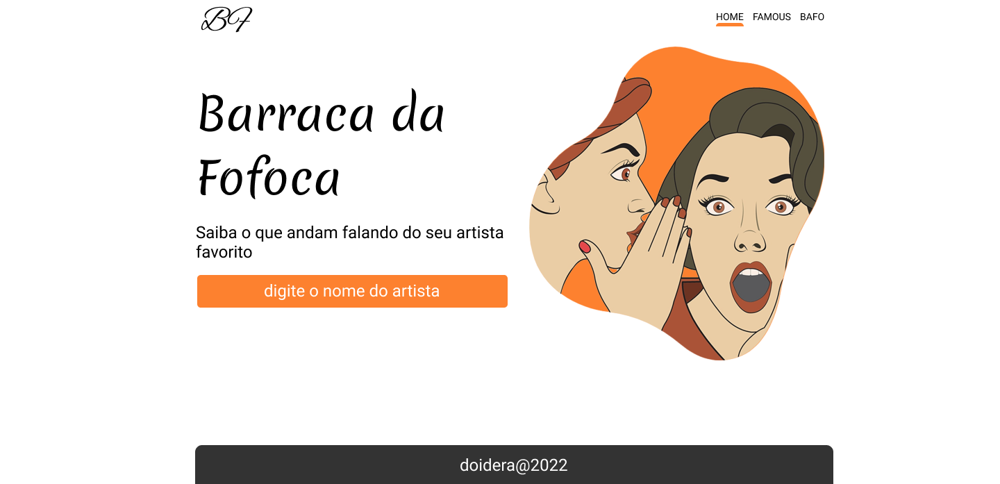

<h4 align="center"> 
	🚧  React em construção...🚀  🚧
</h4>

# Barraca da fofoca

## Este projeto foi criado incentivar o aprendizado de NextJS (React), de forma descontraída e divertida. O projeto realiza uma pesquisa baseado no nome que é digitado e trás as últimas notícias relacionadas a ele.

### O layout pode ser encontrado no figma clicando [aqui](https://www.figma.com/file/QSscThHcvxhAkCk8iBbOTv/barraca-da-fofoca?node-id=0%3A1):

### Development

- [ ] Página index
  - [ ] header
  - [ ] main
  - [ ] footer
- [ ] Página Bofe
- [ ] Página About

## Exemplo da aplicação

<h1 align="center" style="display: flex">
  <a href="https://www.figma.com/file/QSscThHcvxhAkCk8iBbOTv/barraca-da-fofoca?node-id=0%3A1">
  
  </a>
</h1>

### Pré-requisitos

Antes de começar, você vai precisar ter instalado em sua máquina as seguintes ferramentas:
[Git](https://git-scm.com), [Node.js](https://nodejs.org/en/), v14.17.1.
Além disto é bom ter um editor para trabalhar com o código como [VSCode](https://code.visualstudio.com/)

```bash
# Clone este repositório
$ git clone <https://github.com/hubGil/barraca-da-fofoca.git>

# Acesse a pasta do projeto no terminal/cmd
$ cd barraca-da-fofoca

# Instale as dependências
$ npm install

OR

$ yarn

# Execute a aplicação em modo de desenvolvimento
$ yarn dev

OD

$ npm run dev

#  acesse <http://localhost:3000> para ver o resultado


```
### Inclusão de componentes (About)

https://prismic.io/dashboard/signup

Criar novo repositório

Settings / API & Security

1 - Copiar e inserir no código a URL para ter acesso a API 

2 - Permanent access tokens
- Generate an Access Token / Application name / This name will be presented to the users.
- Copiar e inserir no código "Access to master"

3 - Custom Types
- Criar o componente

4 - Documents
- Inserir o conteúdo dos componentes
- Salvar
- Publicar

